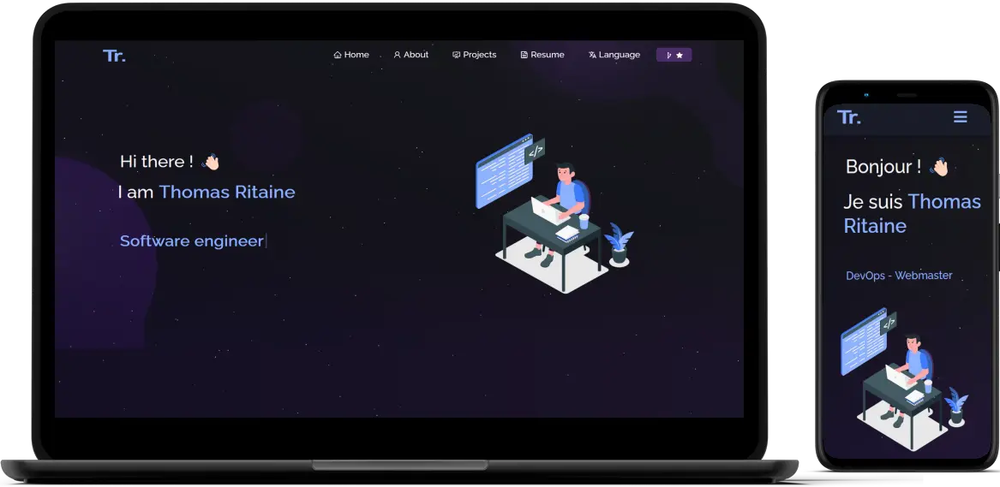

<h2 align="center">
  My Portfolio Website<br/>
  <a href="https://thomas.ritaine.com" target="_blank">thomas.ritaine.com</a>
</h2>
<div align="center">
  
</div>

<br/>

<center>

[](https://forthebadge.com) &nbsp;
[](https://forthebadge.com) &nbsp;
[](https://forthebadge.com) &nbsp;
 &nbsp;


</center>

<h3 align="center">
    🔹
    <a href="https://github.com/ThomasRitaine/portfolio/issues">Report Bug</a> &nbsp; &nbsp;
    🔹
    <a href="https://github.com/ThomasRitaine/portfolio/issues">Request Feature</a>
</h3>

## Built With

My personal portfolio <a href="https://thomas.ritaine.com/" target="_blank">thomas.ritaine.com</a> which features some of my github projects as well as my resume and technical skills.<br/>

This project was built using these technologies.

- React.js
- Node.js
- Express.js
- CSS3
- VsCode
- Docker
- GitHub Actions

## Features

**📖 Multi-Page Layout**

**🎨 Styled with React-Bootstrap and Css with easy to customize colors**

**📱 Fully Responsive**

**🌎 Multi-language**

## Getting Started

Clone down this repository. You will need `git` and `Docker` installed globally on your machine.

## 🛠 Installation and Setup Instructions

All install is done automatically by Docker. You just need to run the following command:
```sh
docker compose -f docker-compose.yml -f docker-compose.dev.yml up
```

And go to [http://localhost](http://localhost)

## Usage Instructions

Open the project folder and Navigate to `/src/components/`. <br/>
You will find all the components used and you can edit your information accordingly.

### Show your support

Give a ⭐ if you like this website!
